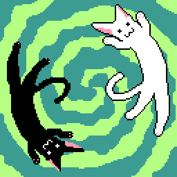

# 混合咪喵像素圆体 / Mixed MaruMinya Pixel Font

开源的泛中日韩像素字体，圆体风格。

原项目 [「x12y12pxMaruMinya」](https://github.com/hicchicc/x12y12pxMaruMinya) 是日语字体，并有多个东亚字形衍生版本。

这些版本均为独立项目，未进行整合，相关字形和特性也没有合并回上游，这导致在多语言环境中使用时不太方便。

本项目尝试进行整合，提供一个特殊构建方案，并进行了若干额外优化。

本项目被视为一种临时性过渡方案，定位与 [「缝合像素字体」](https://github.com/TakWolf/fusion-pixel-font) 类似。

原项目名「x12y12pxMaruMinya」没有正式的中文翻译，笔者暂时将其翻译为「咪 (mi) 喵 (nya~n) 像素圆体 (maru)」，该翻译可能不准确。「混合」则代表混合了多个字体。

Logo 捏他自 [《游戏王》](https://zh.wikipedia.org/wiki/%E9%81%8A%E6%88%B2%E7%8E%8B) 中的 [「融合」](https://www.db.yugioh-card.com/yugiohdb/card_search.action?ope=2&cid=4837&request_locale=ja) 魔法卡卡图，为虚构的通常魔法卡「喵咪结合 / にゃんみ・フュージョン / Nyanmi Fusion」。

> ①：从自己的场上或墓地把「喵咪」融合怪兽卡决定的融合素材怪兽除外，把那１只融合怪兽从额外卡组融合召唤。

## 预览

[点击此链接](https://pixel-font-studio.github.io/mixed-maruminya-pixel-font/playground.html) 实时预览字体效果。

### 12 像素

## 字符统计

通过下面的链接来查看字符统计信息。

| 尺寸 | 等宽模式 | 比例模式 |
|---|---|---|
| 12px | [info-12px-monospaced](docs/info-12px-monospaced.md) | [info-12px-proportional](docs/info-12px-proportional.md) |

## 语言特定字形

目前支持以下语言特定字形版本。

| 版本 | 含义 |
|---|---|
| latin | 泛拉丁语 |
| zh_hans | 简体中文 |
| zh_hant | 繁體中文 |
| ja | 日语 |
| ko | 朝鲜语 |

目前语言特定字形支持并不完整。

这是一个基于补丁的字体解决方案。你不应该对语言特定字形抱有特别的期待。

## 下载

[点击此链接](https://github.com/pixel-font-studio/mixed-maruminya-pixel-font/releases) 下载最新版本。

## 程序依赖

- [Pixel Font Builder](https://github.com/TakWolf/pixel-font-builder)
- [Pixel Font Knife](https://github.com/TakWolf/pixel-font-knife)
- [FontTools](https://github.com/fonttools/fonttools)
- [unicodedata2](https://github.com/fonttools/unicodedata2)
- [Unidata Blocks](https://github.com/TakWolf/unidata-blocks)
- [Character Encoding Utils](https://github.com/TakWolf/character-encoding-utils)
- [PyYAML](https://github.com/yaml/pyyaml)
- [Pillow](https://github.com/python-pillow/Pillow)
- [Beautiful Soup](https://www.crummy.com/software/BeautifulSoup/)
- [Jinja](https://github.com/pallets/jinja)
- [Loguru](https://github.com/Delgan/loguru)
- [Cyclopts](https://github.com/BrianPugh/cyclopts)

## 官方社区

- [「像素字体工房」Discord 服务器](https://discord.gg/3GKtPKtjdU)
- [「像素字体工房」QQ 群](https://qm.qq.com/q/jPk8sSitUI)

## 许可证

分为「字体」和「构建程序」两个部分。

### 字体

使用 [「SIL 开放字体许可证第 1.1 版」](LICENSE-OFL) 授权。

上游字体许可证如下：

| 字体 | 许可证 | 备注 |
|---|---|---|
| [x12y12pxMaruMinya](https://github.com/hicchicc/x12y12pxMaruMinya) | [OFL-1.1](https://github.com/hicchicc/x12y12pxMaruMinya/blob/main/OFL.txt) | 原始项目，提供字体基础风格以及日语汉字字形 |
| [x12y12pxMaruMinyaHangul](https://github.com/quiple/x12y12pxMaruMinyaHangul) | [OFL-1.1](https://github.com/quiple/x12y12pxMaruMinyaHangul/blob/main/OFL.txt) | 韩文衍生，提供谚文以及韩语汉字字形 |
| [ZLabs-RoundPix-12px](https://github.com/Astro-2539/ZLabs-RoundPix-12px) | [OFL-1.1](https://github.com/Astro-2539/ZLabs-RoundPix-12px/blob/main/LICENSE-OFL) | 简体中文衍生，提供简体中文汉字字形 |

### 构建程序

使用 [「MIT 许可证」](LICENSE-MIT) 授权。
